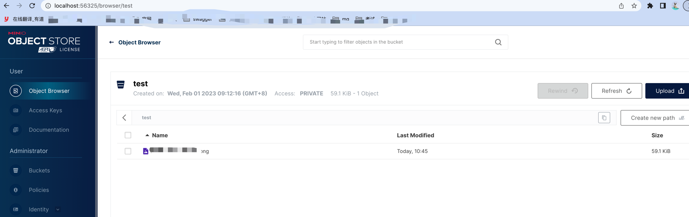

### 对象服务器 minio 简单使用

    脚本：
    w4) nohup minio server /usr/local/minio_data > /usr/local/minio_data/minio.log 2>&1 & ;;
    w5) open -a "/Applications/Google Chrome.app" http://localhost:9000 ;;

### 主页 

